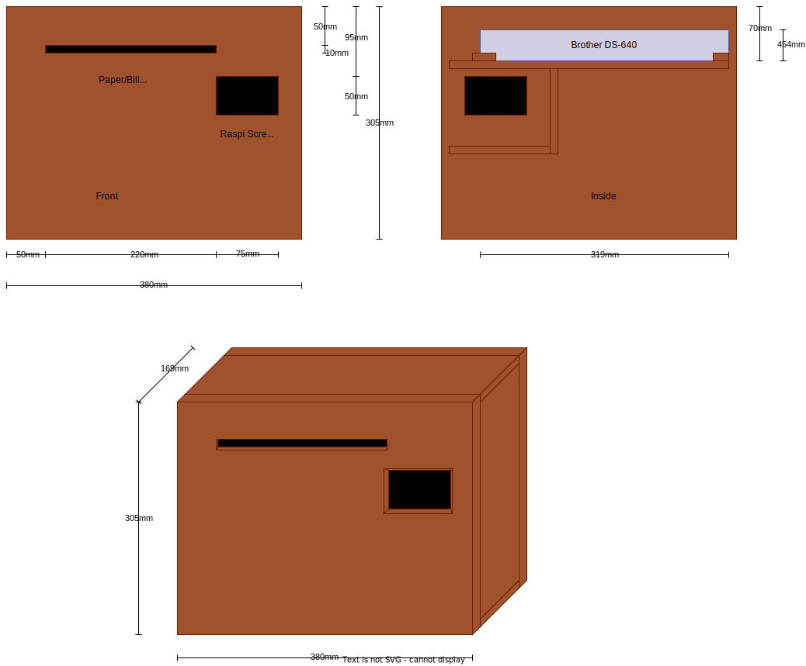

# Bill Scanner

## What does this do?

This small project scans bills and automatically sends them to an email address for further processing.

## Hardware setup

We use a Brother DS-640 connected to a Rasperry Pi Zero 2 W with a Waveshare Touch Display 3.5".


<!---->

The scanner has been customized to allow the Raspberry Pi to control the paper detector. Also, the motor control can be disabled earlier than the scanner does itself.



<!---->

The outer box is made of Multiplex Birch 9mm with a lockable door to the side. The openings for screen and paper intake are miter sawn with 30°.

## Raspberry Pi Setup

Install a new SD Card with Raspbian Bookworm.

Install the display drivers from the Waveshare homepage as described.

Install the python app by default means.

Set the python app as default startup app:

`nano .config/lxsession/LXDE-pi/autostart`:

```
#@lxpanel --profile LXDE-pi
#@pcmanfm --desktop --profile LXDE-pi
@xscreensaver -no-splash
@.venv/bin/scanapp
```
